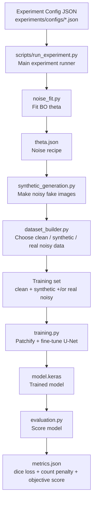

# Cleanup Branch Simple Diagram

This is the simple model of how the cleanup branch works.

```text
CLEANUP BRANCH MODEL

                 ┌────────────────────────────┐
                 │ Experiment Config JSON      │
                 │ experiments/configs/*.json  │
                 └──────────────┬─────────────┘
                                │
                                ▼
                 ┌────────────────────────────┐
                 │ scripts/run_experiment.py   │
                 │ Main experiment runner      │
                 └──────────────┬─────────────┘
                                │
        ┌───────────────────────┼───────────────────────┐
        │                       │                       │
        ▼                       ▼                       ▼
┌───────────────┐       ┌───────────────┐       ┌────────────────┐
│ noise_fit.py  │       │ synthetic_    │       │ dataset_       │
│ Fit BO theta  │──────▶│ generation.py │──────▶│ builder.py     │
└───────┬───────┘       │ Make noisy    │       │ Choose data    │
        │               │ fake images   │       └───────┬────────┘
        ▼               └───────────────┘               │
┌───────────────┐                                       ▼
│ theta.json    │                              ┌────────────────┐
│ noise recipe  │                              │ Training set    │
└───────────────┘                              │ clean/synthetic │
                                               │ /real noisy     │
                                               └───────┬────────┘
                                                       │
                                                       ▼
                                               ┌────────────────┐
                                               │ training.py     │
                                               │ Patchify +      │
                                               │ fine-tune U-Net │
                                               └───────┬────────┘
                                                       │
                                                       ▼
                                               ┌────────────────┐
                                               │ model.keras     │
                                               │ trained model   │
                                               └───────┬────────┘
                                                       │
                                                       ▼
                                               ┌────────────────┐
                                               │ evaluation.py   │
                                               │ Score model     │
                                               └───────┬────────┘
                                                       │
                                                       ▼
                                               ┌────────────────┐
                                               │ metrics.json    │
                                               │ dice loss       │
                                               │ count penalty   │
                                               │ objective score │
                                               └────────────────┘
```

## Mermaid version

If your Markdown viewer supports Mermaid diagrams, this version renders as a flowchart.



## Experiments

```text
Exp 1:
Clean images
+ Synthetic BO-noised images
→ U-Net
→ Metrics

Exp 2:
Clean images
+ Real non-clean images
→ U-Net
→ Metrics

Exp 3:
Clean images
+ Synthetic BO-noised images
+ Real non-clean images
→ U-Net
→ Metrics

Exp 4:
r real non-clean images
→ fit BO theta
→ make synthetic noisy images

3-r real non-clean images
+ clean images
+ synthetic noisy images
→ U-Net
→ Metrics
```

## Tiny version

```text
Config
→ BO noise fitting
→ Synthetic noisy images
→ Build training set
→ Train U-Net
→ Evaluate model
→ Compare Exp 1 / Exp 2 / Exp 3 / Exp 4
```
